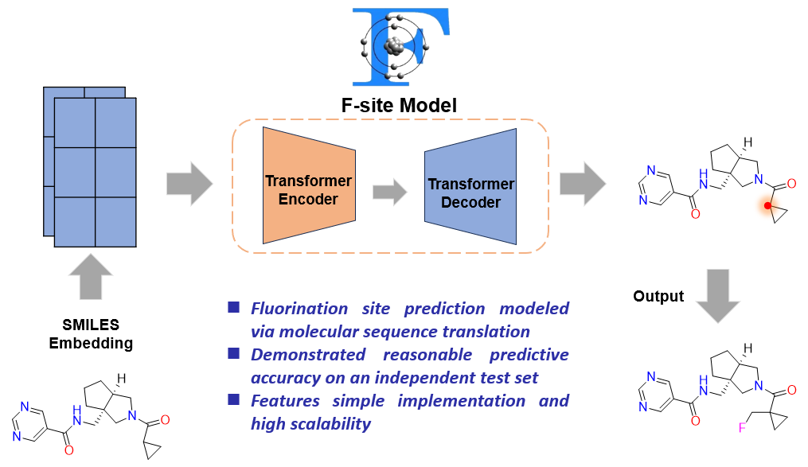

## F-site: Recognizing Fluorination Patterns in Small-molecule Drugs via Two-Stage Transformer-based Model

This repository contains code and instructions for training and using the F-site model, which is a Transformer-based molecular fluorine modification model used to predict the fluorine substitution points of small molecule compounds.



### Package Installation

#### Create Conda Environment

```bash
conda create -n f-site python=3.8
```

#### Install OpenNMT-py

This project is based on [OpenNMT-py](https://github.com/OpenNMT/OpenNMT-py), an open-source toolkit for neural machine translation and large language modeling.

```bash
git clone https://github.com/OpenNMT/OpenNMT-py.git
cd OpenNMT-py
python setup.py install
```

#### Install Additional Dependencies

```bash
conda install cython
conda install spacy
conda install -c conda-forge rapidfuzz
pip install rdkit
pip install pandas
pip install scikit-learn
```

---

### Usage

#### Data Preprocessing

1. **Sanitize and Normalize SMILES**

   Clean and standardize the original SMILES data:

   ```bash
   python ./script/Sanitization_smi.py \
    --input_file "${DATA_DIR}/ChEMBL/ChEMBL_F.csv" \
    --output_file "${DATA_DIR}/ChEMBL/ChEMBL_F_clear.csv"
   ```

2. **Filter Based on Properties**

   Apply filtering based on predefined physicochemical properties:

   ```bash
   python ./script/Filter_data.py \
    --input_csv "${DATA_DIR}/ChEMBL/ChEMBL_F_clear.csv" \
    --output_csv "${DATA_DIR}/ChEMBL/ChEMBL_F_filter.csv"
   ```

3. **Extract Fluorinated Patterns**

   Generate datasets containing fluorinated substructures:

   ```bash
   python ./script/Get_patt_F.py \
    --input_csv "${DATA_DIR}/ChEMBL/ChEMBL_F_filter.csv" \
    --output_dir "${DATA_DIR}/ChEMBL/F_Sub"
   ```

4. **Convert to Training Triplets**

   Convert the data into triplet format: `base`, `marked`, and `original`:

   ```bash
   python ./script/Cut_save_F.py \
    --input_dir "${DATA_DIR}/ChEMBL/F_Sub" \
    --output_dir "${DATA_DIR}/ChEMBL/F_Pair"
   ```

5. **Generate Vocabulary**

   Create vocabulary for tokenization (Run after data splitting):

   ```bash
   python ./script/Generate_vocab.py \
    --data_dir "${RUN_DIR}/sampled" \
    --vocab_dir "${RUN_DIR}"
   ```

6. **Tokenize SMILES**

   Tokenize data using the vocabulary (Run after data splitting):

   ```bash
   python ./script/Tokenize_smiles.py \
    --data_dir "${RUN_DIR}/sampled" \
    --vocab_file "${RUN_DIR}/shared.vocab" \
    --output_dir "${RUN_DIR}/sampled/tokenized"
   ```

---

#### Data Splitting

Split data into train/validation sets, the test dataset has been independently saved:

```bash
python Data_split.py \
    --benchmark_dir "${DATA_DIR}/ChEMBL/F_Pair" \
    --test_file "${DATA_DIR}/Drug/Drug_F_filter.csv" \
    --output_dir "${RUN_DIR}/sampled"
```

---

#### Training Model

Train the F-site model using Transformer configurations:

```bash
# Training Stage I model
onmt_train -config ./TrfmconfigM1.yaml
# Training Stage II model
onmt_train -config ./TrfmconfigM2.yaml
```

**Optional:** Resume training from a saved checkpoint:

```bash
onmt_train -config ./TrfmconfigM1.yaml -train_from ./model-directory/model_step_50000.pt
```

---

#### Inference

Run inference using the trained models:

```bash
onmt_translate -model ./model-directory/model_step_100000.pt \
               -src ./output/Test-src.txt \
               -output ./output/Test-pred.txt \
               -gpu 0 \
               -n_best 5 \
               -beam_size 7 \
               -verbose
```

This command performs site prediction (Stage I) and molecular reconstruction with fluorinated groups (Stage II), based on the test input.

#### Ensemble Models at Inference

If you want to achieve better inference accuracy, you can consider the ensemble models and run the following command:

```bash
onmt_translate -model ./model1_seed1 model2_seed2 model3_seed3 \
               -src ./output/Test-src.txt \
               -output ./output/Test-pred.txt \
               -gpu 0 \
               -n_best 5 \
               -beam_size 7 \
               -verbose
```
